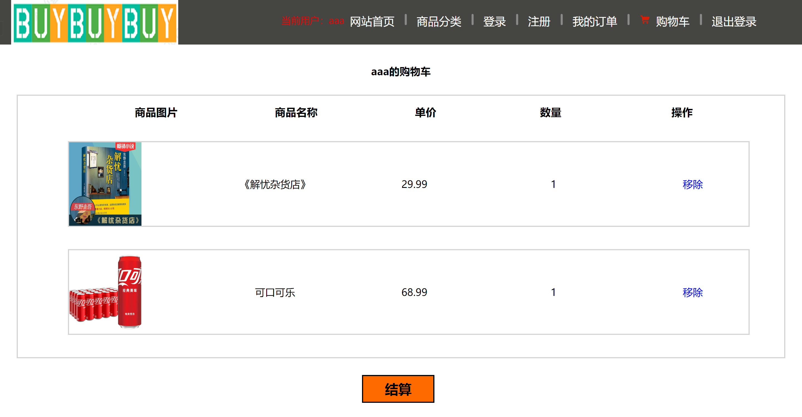
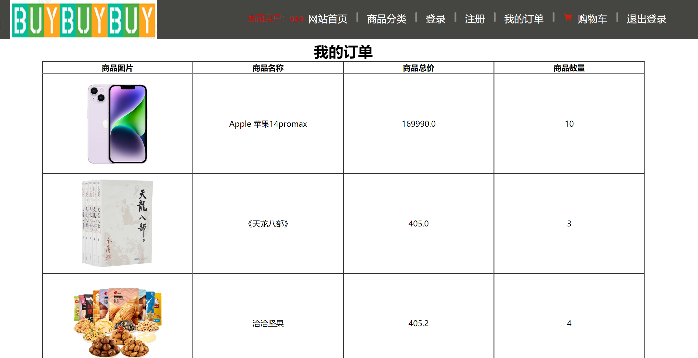

# BuyBuyBuy-ShoppingMall

**JavaWeb-买买买购物网**

## **运行环境**：

- 编程语言：Java
- JDK版本：1.8
- 开发工具：IntelliJ IDEA 2021.3.3 / Maven
- 数据库：MySQL 8.0.29
- 服务器：Tomcat 9.0.39

---

## 购物网功能：

1. 登录注册，输入格式的判断、验证码。

2. 展示所有商品、单个商品、按类别展示商品。

3. 购物车的实现。

4. 订单记录的查看

---

## 数据库设计

**用户表(user)**

| 字段名   | 类型         | 注释         |
| -------- | ------------ | ----------- |
| id       | int          | 用户id       |
| name     | varchar(50) | 用户名称     |
| password | varchar(50) | 用户密码     |
| phone    | varchar(11)  | 用户手机号码 |
| address  | varchar(255) | 用户收货地址 |

**商品表(goods)**

| 字段名 | 类型 | 注释 |
| ------ | ---- | ---- |
| id   | int  | 商品id |
| name | varchar(80) | 商品名称 |
| goods_info | varchar(255) | 商品信息 |
| category | varchar(30) | 商品类别 |
| price | decimal(10,2) | 商品价格 |
| count | int  | 商品数量 |
| hot  | enum('是','否') | 是否为热门商品 |
| image | varchar(255) | 商品图片 |

**订单表(orders)**

| 字段名    | 类型   | 注释         |
|-----------|--------|--------------|
| id        | int    | 订单号       |
| user_id   | int    | 用户id       |
| goods_id  | int    | 商品id       |
| goods_num | int    | 商品数量     |

**购买历史表(buy_history)**

| 字段名    | 类型     | 注释         |
|-----------|----------|--------------|
| user_id   | int      | 用户id       |
| goods_id  | int      | 商品id       |
| time      | datetime | 购买时间     |

## 运行结果

**登录**

**注册**

**首页**

**商品分类**

**展示单个商品**

**购物车**

**订单查询**

---

**效果演示**

http://www.howonenew.com:8080/shopping
